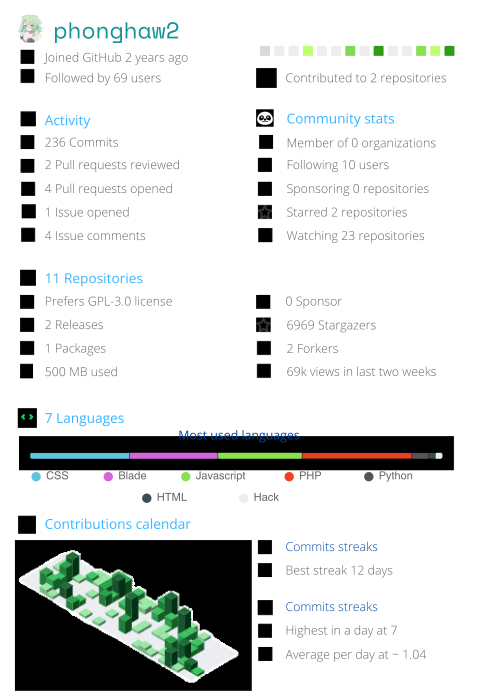
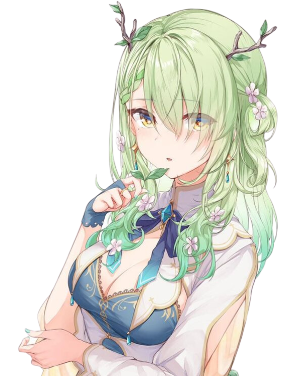

 
    
    

 
 

&nbsp;

 
 

    ~
    ~
    ~
    ~
    ~
    ~
    ~
    ~
    ~
    ~
    ~
    ~
    ~
    ~
    ~

 

 
  

 
  
<h2 align="center"> Where to find me </h2>

  
  
  
  
  

 

# Latest Blogs
<!-- HASHNODE_BLOG:START -->
<!-- HASHNODE_BLOG:END -->

