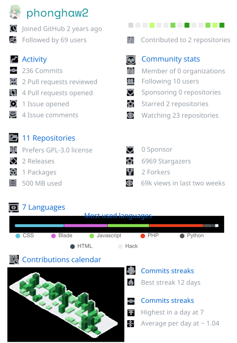

 
    
    

 
 

&nbsp;

 
 

    ~
    ~
    ~
    ~
    ~
    ~
    ~
    ~
    ~
    ~
    ~
    ~
    ~
    ~
    ~

 

 
  

 
  
<h2 align="center"> Where to find me </h2>

  
  
  
  
  

 

# Latest Blogs
<!-- HASHNODE_BLOG:START -->
- [Môn ngữ văn](https://phonghaw2coder.hashnode.dev/mon-ngu-van)
- [Chút kỷ niệm ở Shizuoka](https://phonghaw2coder.hashnode.dev/chut-ky-niem-o-shizuoka)
- [Tưởng là trick nhưng hóa ra lại là "chick"](https://phonghaw2coder.hashnode.dev/tuong-la-trick-nhung-hoa-ra-lai-la-chick)
- [OOP Design Pattern in JS](https://phonghaw2coder.hashnode.dev/oop-design-pattern-in-js)
- [My cheat-shiet Javascript](https://phonghaw2coder.hashnode.dev/my-cheat-shiet-javascript)
<!-- HASHNODE_BLOG:END -->

